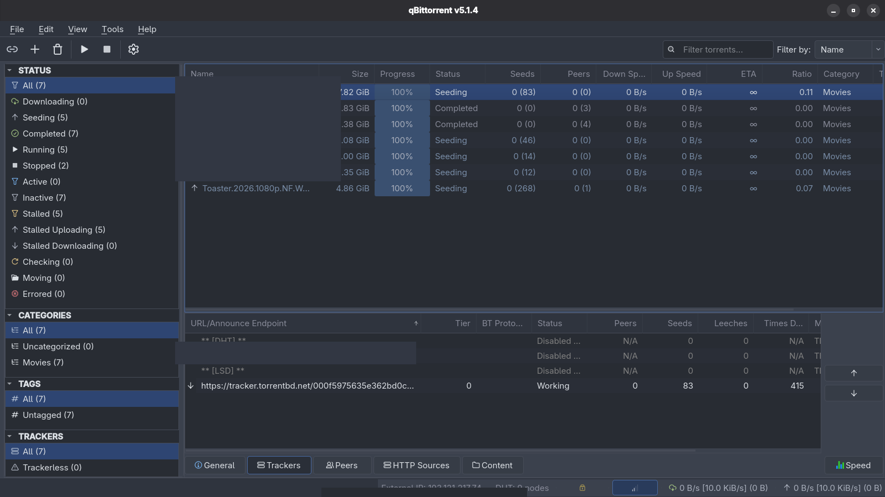
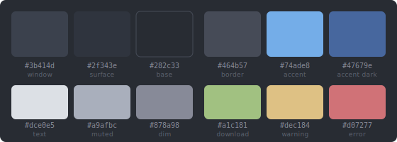
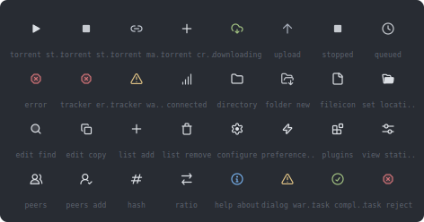

# Zed One Dark - qBittorrent Theme

A port of [Zed editor](https://zed.dev)'s One Dark theme for qBittorrent v5.x.

## Screenshots

<!-- Add screenshots to preview/ and update paths below -->


## Colors



## Icons



86 icons sourced from [Zed editor assets](https://github.com/zed-industries/zed/tree/main/assets/icons), recolored for the One Dark palette.

## Installation

1. Download `zed-one-dark.qbtheme` from [Releases](https://github.com/dreygur/qbit-theme/releases/latest)
2. Open qBittorrent > **Tools > Options > Behavior > Interface**
3. Check **Use custom UI Theme**
4. Select the downloaded `.qbtheme` file
5. Click OK and restart qBittorrent

Requires qBittorrent **v5.0+**.

## Building

Requires Qt6 `rcc`:

```bash
# Fedora
sudo dnf install qt6-qtbase-devel

# Debian/Ubuntu
sudo apt install qt6-base-dev

./build.sh
```
